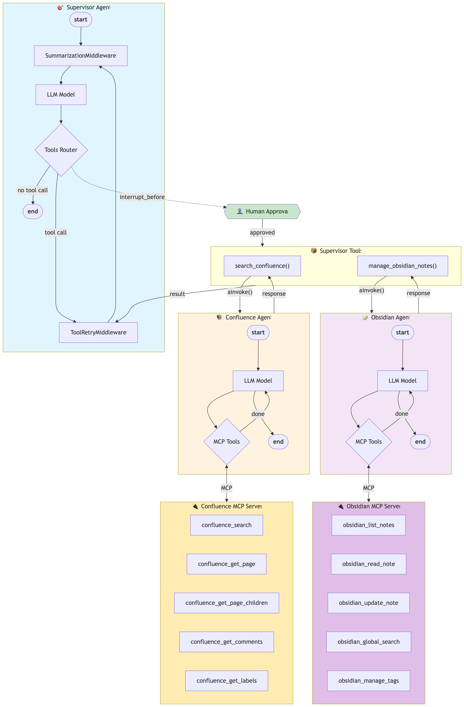
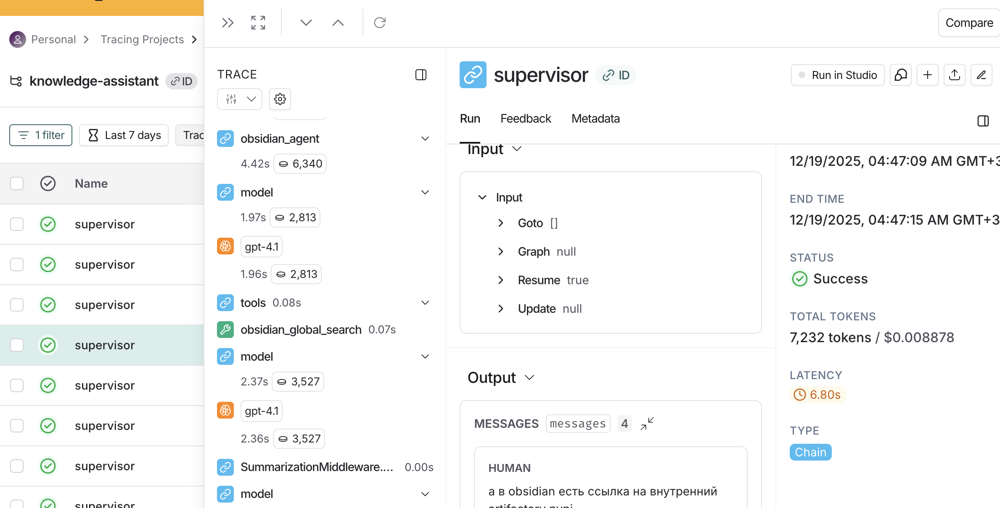

# Knowledge Assistant - Мультиагентная система для управления знаниями

Мультиагентная система для работы с корпоративной документацией (Confluence) и личными заметками (Obsidian) с использованием LLM. Проект построен на основе LangGraph и интегрирован с MCP (Model Context Protocol) серверами.

> ⚡ **О проекте. Инженерная культура:**

Этот репозиторий разрабатывается по лучшим практикам (дада, если бы):  
- **Современный Python** (>=3.13), строгая типизация
- **Менеджер пакетов [uv](https://uv.pyfound.org/)**: быстрая установка и около стандарт без мучений
- **[pre-commit](https://pre-commit.com/)**: автоформатирование, автоисправление стиля и lint 
- **[ruff](https://docs.astral.sh/ruff/)** – быстрый и строгий линтер/форматер  

Также при реализации проекта использованы следующие MCP-server:
- [Obsidian MCP server](https://github.com/cyanheads/obsidian-mcp-server)
- [Confluence MCP server](https://github.com/sooperset/mcp-atlassian)

## 🧠 Что это такое?

Это мультиагентная система (MAS), которая:
1. **Ищет информацию в Confluence** — корпоративная документация, wiki-страницы, спецификации
2. **Управляет заметками в Obsidian** — создание, редактирование, поиск личных записей
3. **Координирует агентов** через Supervisor (as tools), который решает кому делегировать задачу
4. **Обеспечивает контроль** через Human-in-the-Loop — вы одобряете действия перед выполнением
5. **Предоставляет удобный веб-интерфейс** на Streamlit с полноценным чатом

## 🏗️ Архитектура системы

Проект построен на основе **LangGraph** и использует паттерн **Supervisor с Agents-as-Tools**. Система работает в несколько уровней:

```
Запрос пользователя → Supervisor Agent → [Human Approval] → Sub-Agent (Confluence/Obsidian) → MCP Server → Результат
```

### Визуализация workflow

Полная схема работы системы представлена на диаграмме:



### Ключевые компоненты:

1. **Supervisor Agent** — Центральный координатор, который:
   - Анализирует запрос пользователя
   - Решает, какому sub-агенту делегировать задачу
   - Использует `SummarizationMiddleware` для управления контекстом
   - Поддерживает `interrupt_before` для Human-in-the-Loop

2. **Confluence Agent** — Специалист по корпоративной документации:
   - Поиск по страницам Confluence (CQL)
   - Чтение содержимого страниц
   - Работа с комментариями и метками
   - Навигация по дочерним страницам

3. **Obsidian Agent** — Специалист по личным заметкам:
   - CRUD операции над заметками
   - Глобальный поиск по vault
   - Управление тегами и frontmatter
   - Работа со структурой папок

4. **MCP Servers** — Внешние сервисы:
   - **Confluence MCP** — API для работы с Confluence
   - **Obsidian MCP** — API для работы с локальным vault

### Особенности архитектуры

| Компонент | Технология | Назначение |
|-----------|------------|------------|
| Supervisor | `create_agent` + middleware | Координация и делегирование |
| Sub-Agents | `create_agent` (ReAct) | Исполнение специализированных задач |
| MCP Adapters | `langchain-mcp-adapters` | Интеграция с внешними MCP-серверами |
| Checkpointer | `MemorySaver` | Сохранение состояния диалога |
| UI | Streamlit | Веб-интерфейс с чатом |

## 📦 Quick start

### Требования

- Python >= 3.13
- UV package manager (рекомендуется) или pip (если любите страдать)
- Запущенные MCP-серверы для Confluence и Obsidian (первый желательно в контруе oAuth есть)

### Установка зависимостей

```bash
uv sync
```

### Настройка переменных окружения

Создайте файл `.env` в корне проекта со следующими переменными:

```env
# API ключ для OpenAI (или совместимого API)
OPENAI_API_KEY=your_openai_api_key_here
OPENAI_API_BASE=https://api.openai.com/v1  # опционально, для vLLM/etc
OPENAI_DEFAULT_MODEL=gpt-4.1

# LangSmith трейсинг (опционально)
LANGSMITH_API_KEY=your_langsmith_key_here
LANGSMITH_PROJECT=knowledge-assistant

# MCP серверы (для локальной разработки)
CONFLUENCE_MCP_URL=http://127.0.0.1:9000/mcp
OBSIDIAN_MCP_URL=http://127.0.0.1:3010/mcp

# Human-in-the-Loop
ENABLE_HUMAN_APPROVAL=true
```

### Запуск приложения

```bash
# Веб-интерфейс (Streamlit)
streamlit run src/app.py

# CLI режим (интерактивный)
python src/main.py
```

После запуска откройте браузер и перейдите по адресу `http://localhost:8501`.

## 🎨 Пользовательский интерфейс

Веб-интерфейс построен на **Streamlit** и предоставляет:

### Элементы интерфейса:

- **Чат** — основная область для общения с системой
- **Sidebar с настройками**:
  - Информация о подключённых MCP-серверах
  - Текущая модель и температура
  - Статус Human-in-the-Loop
  - Кнопка "New Conversation"
- **Approval UI** — интерфейс для одобрения/отклонения действий агентов


### Human-in-the-Loop Flow

Когда агент собирается выполнить действие:
1. Система приостанавливает выполнение
2. Показывает вам список инструментов и их аргументы
3. Вы можете **Approve** или **Reject**
4. При одобрении — действие выполняется
5. При отклонении — агент получает сообщение об отказе

## 📝 Примеры использования (общие примеры без конкретизациии, идеальный сценарий)

### Пример 1: Поиск документации в Confluence

**Запрос:**
```
Найди документацию по API авторизации
```

**Что происходит:**
1. Supervisor определяет, что нужен Confluence Agent
2. Делегирует задачу через `search_confluence` tool
3. Confluence Agent использует `confluence_search` для поиска
4. Результаты возвращаются пользователю

### Пример 2: Создание заметки в Obsidian

**Запрос:**
```
Создай заметку с результатами сегодняшней встречи: обсудили архитектуру нового сервиса, решили использовать микросервисы
```

**Что происходит:**
1. Supervisor определяет, что нужен Obsidian Agent
2. [Human Approval] — показываются детали операции
3. После одобрения — Obsidian Agent создаёт заметку
4. Подтверждение возвращается пользователю

### Пример 3: Комплексная задача

**Запрос:**
```
Найди в confluence информацию про деплой сервисов и сохрани ключевые моменты в мои заметки
```

**Что происходит:**
1. Supervisor разбивает задачу на части
2. Сначала вызывает Confluence Agent для поиска
3. Затем вызывает Obsidian Agent для сохранения
4. Объединяет результаты в финальный ответ

**Пример трейсов Langsmith**



**Небольшое демо**

https://github.com/alextarit/knowledge-assistant-confluence-obsidian/raw/main/docs/videos/example_demo_compressed.mp4

P.s. демонстрация сильно обрезана, поскольку в определенный момент осознано, что слишком много данных могут быть квалифицированы чувствительными, несмотря на замазывание секретов и прочего

## 🛠️ Технологии и библиотеки

### Основные технологии:

- **LangGraph** — создание мультиагентных workflow
- **LangChain** — работа с LLM и инструментами
- **langchain-mcp-adapters** — интеграция с MCP серверами
- **Streamlit** — создание веб-интерфейса
- **OpenAI API** — языковая модель
- **LangSmith** — трейсинг и мониторинг (опционально)

### Ключевые паттерны:

| Паттерн | Реализация |
|---------|------------|
| Supervisor | `SupervisorSystem` координирует sub-агентов |
| Agents-as-Tools | Sub-агенты обёрнуты в `@tool` декораторы |
| ReAct | Каждый агент использует reasoning loop |
| Human-in-the-Loop | `interrupt_before=["tools"]` |
| Context Management | `SummarizationMiddleware` |
| Retry Policy | `ToolRetryMiddleware` с exponential backoff |

### Полный список зависимостей:

См. файл `pyproject.toml` для полного списка зависимостей и их версий.

## 📁 Структура проекта

```
lab2/
├── src/                           # Основной код проекта
│   ├── app.py                     # Веб-интерфейс на Streamlit
│   ├── main.py                    # CLI точка входа
│   ├── agents/                    # Агенты системы
│   │   ├── supervisor_agent.py    # Supervisor tools и промпт
│   │   ├── supervisor_graph.py    # SupervisorSystem - координатор
│   │   ├── confluence_agent.py    # Агент для Confluence
│   │   └── obsidian_agent.py      # Агент для Obsidian
│   ├── config/                    # Конфигурация
│   │   └── settings.py            # Pydantic Settings
│   ├── prompts/                   # System prompts для агентов
│   │   ├── supervisor_agent_prompt.md
│   │   ├── confluence_agent_prompt.md
│   │   └── obsidian_agent_prompt.md
│   ├── utils/                     # Утилиты
│   │   └── llm_retry.py           # RetryableLLM с temperature bump
│   └── logger/                    # Логирование
│       └── logger.py              # Конфигурация логов
├── docs/                          # Документация
│   ├── images/
│   │   └── arch_supervisor_as_tools.png  # Диаграмма архитектуры
│   └── videos/
│       └── example_demo_compressed.mp4   # Демо приложения
├── pyproject.toml                 # Конфигурация проекта и зависимости
└── README.md                      # Этот файл
```

## 🔧 Расширение системы

### Добавление нового агента

1. Создайте файл `src/agents/new_agent.py`
2. Добавьте промпт `src/prompts/new_agent_prompt.md`
3. Добавьте MCP конфиг в `settings.py`
4. Зарегистрируйте tool в `supervisor_agent.py`

### Добавление нового MCP сервера

```python
# settings.py
NEW_MCP_URL: str = "http://127.0.0.1:xxxx/mcp"

@property
def new_mcp_config(self) -> dict:
    return {"new_service": {"url": self.NEW_MCP_URL, "transport": "streamable_http"}}
```

## ⚡ Пути улучшения 

Наверное, тут стоит начать, что всегда имеется trade-off и переусложненние будет ввести только к излишним расходам как в деньгах так и ux из-за ожидания.

- Я бы не множил агентов сильно
- Посмотрел бы в парралельное использование также graphRAG по confluence, хотя это тоже весьма проблематично с большими объемами и обновлениями
- Написать несложно, вывести в прод не просто
- Просто лучше сложного, решение еще надо и поддерживать )))
- Новые интеграция с агентами, решение расширяемо, что выше подчеркнуто

## 🪞 Рефлексия

- В некоторых запросах агент с инструментом Confluence (agentic RAG) ведет себя сомнительно из-за слабого полнотекстового поиска Confluence.
- Проблема решаема, но очень дорогая:
  - крупные зеленые компании вручную и скриптами структурируют Confluence;
  - можно строить GraphRAG как дополнительную память и навигацию по онтологии;
  - формировать динамический промпт/память по действиям пользователя, выделяя самые частые взаимосвязи.
- Это простор для экспериментов и разных сочетаний, но все долго и дорого. 2026 год ожидается "годом памяти" (прошел год от Titan архитектуры от Google :)), и есть надежда на легкий и договоренный слой памяти без кучи навешанных правил, ближе к человеческой.
- В Confluence порой даже человек не сможет и за час найти нужную страницу, если не знать, в каком пространстве она примерно существует.
- Поскольку у нас Supervisor as tools, мы можем разнести интеграции ближе к цели/сервису, отдельно отлаживать и тестить на датасетах, уходя от архитектурного монолита. Так при создании реестра агентов будет проще все это вести и отслеживать жизненный цикл.

## 📄 Лицензия (MIT)

Этот проект создан в учебных целях.

## 🤝 Вклад

Проект создан в рамках лабораторной работы по курсу LLM.

---
